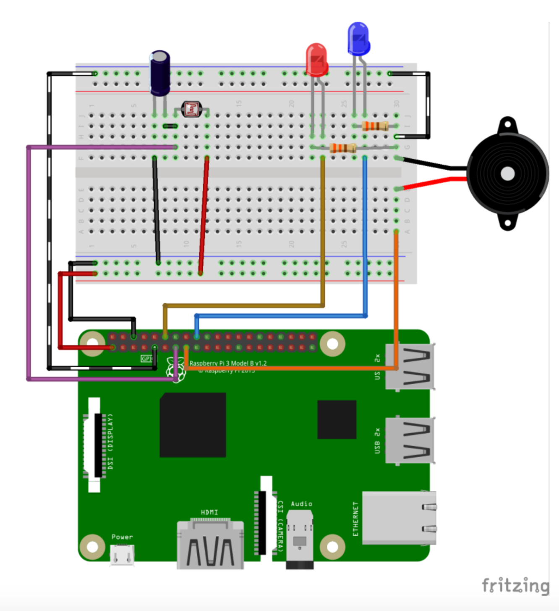

# TP - Capteur de luminosité.:

Fonctionnement : 
Le nom technique du composant est `Light Dependant Resistor` = Résistance Sensible à la lumière. 
Ce que veut dire que la charge de notre résistance varie suivant la lumière qu’elle reçoit. On ne pourra pas mesurer précisément la lumière, mais nous pourrons surveiller les changements de charge et ainsi en interpréter l’absence ou la présence de lumière.

Pour interpréter cette valeur dans notre code nous allons avoir besoin d’un autre composant : Un condensateur.
Un condensateur est un composant qui se charge rapidement en recevant de l’énergie, et qui se décharge plus lentement.
Ici nous l’utiliserons comme suit :
Alors que le condensateur se charge, le raspberry va compter en combien de temps la broche va passer de ‘off’ à ‘on’ en utilisant une simple variable qui s’incrémente. Cette variable représente combien de lumière capte la résistance. Plus il y a de lumière, moins la charge de la résistance est grande, en conséquence plus vite le condensateur se déchargera et la valeur de la variable sera basse.

Montage *(pas besoin des LEDs)*: 



Script *(à mettre dans un fichier, `light.py`  par exemple)*

```
import RPi.GPIO as GPIO
import time

# Initialisation des GPIOs

GPIO.setmode(GPIO.BCM)
GPIO.setwarnings(False)

# Numéro de la broche que nous allons utiliser pour lire 
# les données
broche=27

def read_light():
    lightCount = 0 #intitialisation de la variable de lumière
    GPIO.setup(broche, GPIO.OUT)
    GPIO.output(broche, GPIO.LOW)
    time.sleep(0.1) # on draine la charge du condensateur
    GPIO.setup(broche, GPIO.IN)
    #Tant que la broche lit ‘off’ on incrémente notre variable
    while (GPIO.input(broche) == GPIO.LOW):
        lightCount += 1
    return lightCount

# Boucle infini jusqu'à CTRL-C
while True:
    print(read_light())
    time.sleep(1)
```