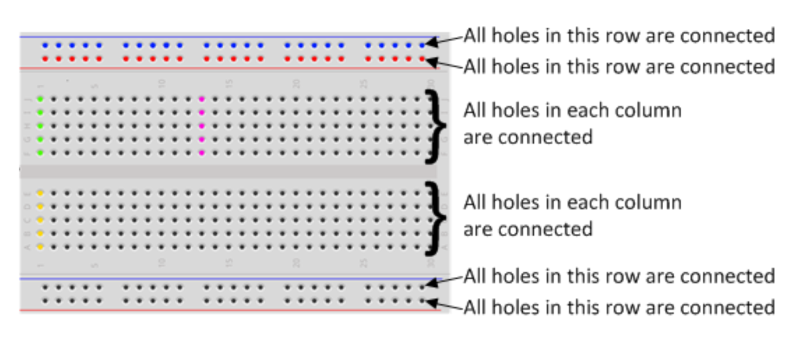
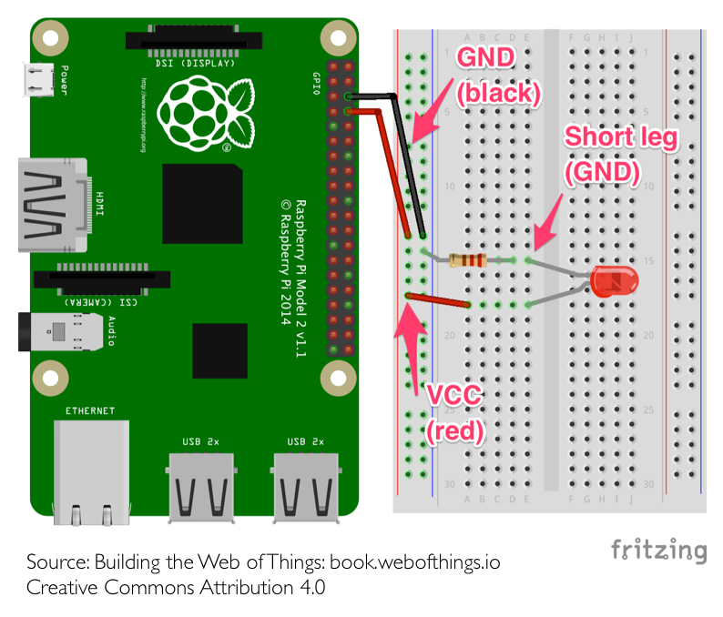

Contrôle de LEDs
----------------

. Utilisation de la breadboard : 


. Réalisez ce montage :  
_Pour empêcher que la LED demande trop de courant au raspberry, on ajoute une résistance de 330 Ohms. Rappel du lycée, la loi d'Ohm : U = R * I. Pour fonctionner correctement notre LED a besoin de 10 mA, nous avons donc R(330) * I(0,010) = 3,3V, ce qui correspond à la tension envoyée par le raspberry_  

_Pour identifier la resistance, regardez les couleurs dessus, la 330 Ohm a les couleurs Orange, Orange, Marron_


. Vérifiez que `RPi.GPIO` est installé (un utilitaire node pour contrôler les GPIOs) : 

```
$ pip install RPi.GPIO
```
 
. Dans le dossier du serveur, créez un fichier `led.py` 
Commandes python utiles : 

```python
#import des utilistaires python
import RPi.GPIO as GPIO
import time

#Utilisation d'une norme de nommage pour les broches
GPIO.setmode(GPIO.BCM)
GPIO.setwarnings(False)

#initialisation de la broche en mode "sortie"
#⚠️ Le nombre passé en paramètre correspond au numéro de GPIO et non au numéro de la broche.
GPIO.setup(14, GPIO.OUT)

print("Led On")
#On indique à la pin GPIO 14 que l'on veut envoyer du courant sur celle-ci
GPIO.output(14, GPIO.HIGH)
#On demande au script d'attendre 5 secondes
time.sleep(5)
#On dit à la pin GPIO 14 d'arrêter d'envoyer du courant.
GPIO.output(14, GPIO.LOW)
print("Led Off")

#On indique qu'on a fini d'utiliser les GPIOs
GPIO.cleanup()
```

. Modifiez le script et le montage électronique pour allumer les deux LEDs du Kit.