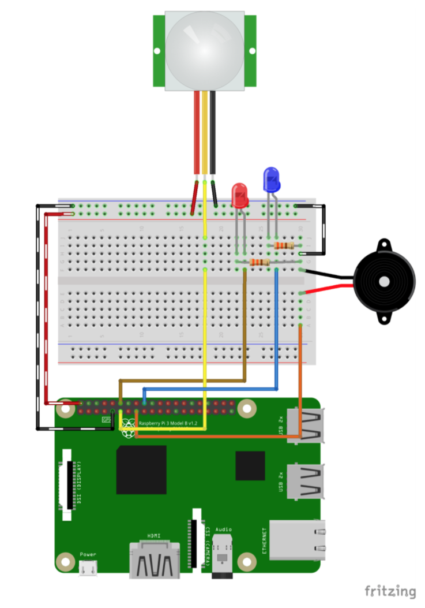

TP Mouvement
=============
_infos pratiques_ : tous les raspberry ont pour login `pi` et pour mot de passe `raspberry`

1ère partie : Capteur de mouvement
---------------------------------- 

. Réalisez ce montage : 


_Lorsque le capteur détecte un mouvement, il envoie un signal sur son fil jaune. Nous allons donc configurer notre raspberry pour recevoir ce signal sur un de ses GPIOs_  

. Créez le fichier `movement.py` : 


```python
import RPi.GPIO as GPIO
import time

# Initialisation de notre GPIO 17 pour recevoir un signal
# Contrairement à nos LEDs avec lesquelles on envoyait un signal
broche=17
GPIO.setmode(GPIO.BCM)
GPIO.setwarnings(False)
GPIO.setup(broche, GPIO.IN)

currentstate = 0
previousstate = 0

# Boucle infini jusqu'à CTRL-C
while True:
    # Lecture du capteur
    currentstate = GPIO.input(broche)
		 # Si le capteur est déclenché
    if currentstate == 1 and previousstate == 0:
        print("    Mouvement détecté !")
        # En enregistrer l'état
        previousstate = 1
    # Si le capteur est s'est stabilisé
    elif currentstate == 0 and previousstate == 1:
        print("    Prêt")
        previousstate = 0
    # On attends 10ms
    time.sleep(0.01)

```

. Une fois que tout fonctionne correctement, modifiez le script pour allumer/éteindre une LED lorsqu'il y a du mouvement. (si vous avez le temps, ajoutez le buzzer pour qu'il sonne pendant 1 s dès qu'il y a du mouvement également.)


2ème partie : SocketIO 
------------------------

Ici c'est le capteur qui nous fait part d'un événement. Or avec nos page web statique nous n'avons pas de moyen de réagir à ces événement. Jusque là, nous récupérions une page web et l'interaction avec le serveur était terminée. Par exemple, il nous fallait rafraichir la page web pour mettre à jour la température. Ce qui n'est pas pratique dans notre détection de mouvement.  
Nous allons donc utiliser des **Sockets**.  
Une socket est un canal de communication entre un serveur et un client (le navigateur). Les données peuvent transiter dans les deux sens. Pour notre utilisation, nous ferons en sorte que le serveur notifie le client dès qu'il détecte un mouvement.

3ème partie : Websockets & Mouvements 
-------------------------------------

. Modifiez le serveur avec les websockets récupéré à l'exercice précédent pour que le serveur envoie un message au client lorsqu'il y a du mouvement. Attention  au multi-threading (lire les commentaires présent dans le code de server.py)

. Ajoutez le capteur de température pour également donner la température en temps réel.