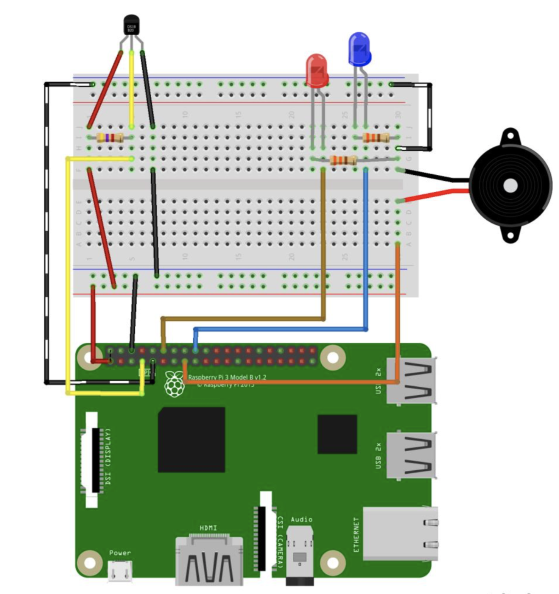
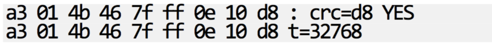

TP Capteur de température
=========================
_infos pratiques_ : tous les raspberry ont pour login `pi` et pour mot de passe `raspberry`

1ère partie : Capteur de température
------------------------------------
_ne démarrez pas votre raspberry tout de suite, réalisez le montage avec le raspberry éteind._  

. Réalisez ce montage : (**sans les LEDs ni le buzzer**)  
**Pour le capteur de température, faites bien attention aux couleurs des fils**  
*la résistance qui va intervenir pour le capteur de température est une résitstance de 4,7 kOhm, c'est celle qui est différente des deux autres, elle porte les couleurs Jaune, Violet, Rouge*

. Pour vérifier que votre montage correspondant au capteur de température est correcte, nous allons vérifier que le système reconnait bien notre capteur :  
- Connectez-vous au raspberry  
- Affichez la liste des appareils connectés :  

```
$ ls /sys/bus/w1/devices
```
_Cette commande devrait vous afficher un dossier commençant par 28-XXXXXX (les X étant une longue série de caractères). C'est dans ce dossier que le capteur de température va écrire ses données_  
- Visualisez les données remontées par le capteur avec la commande : 

```
$ cat /sys/bus/w1/devices/28-XXXXXXXX/w1_slave
```
_Remplacez les X par ce que vous avez eu lors de la précédente commande._  
- Vous devriez avoir comme résultat quelque chose de ce type : 

_La température remontée par votre capteur est le nombre en bas à droite, divisez celui-ci par 1000 pour avoir la temérature en degrées celcius._  

. Dans le dossier de votre binôme (créez-en un nouveau si vous n'en avez pas), créez un nouveau dossier s'intitulant `temperature` (sans accent), et allez dans ce dossier.   

. créez un fichier `temperature.py` dans votre dossier serveur :

```python
# Imports
import os
import glob
import time

# Intialisation des broches
os.system('modprobe w1-gpio')  # Allume le module 1wire
os.system('modprobe w1-therm')  # Allume le module Temperature

# Chemin du fichier contenant la température (remplacer par votre valeur trouvée précédemment)
device_file = '/sys/bus/w1/devices/28-XXXXXXXX/w1_slave'

# Une fonction qui lit dans le fichier température
def read_temp_raw():
    f = open(device_file, 'r')  # Ouvre le dichier
    lines = f.readlines() # Returns the text
    f.close()
    return lines
    
# Lis la temperature 
def read_temp():
    lines = read_temp_raw()  # Lit le fichier de température
    # Tant que la première ligne ne vaut pas 'YES', on attend 0,2s
    # On relis ensuite le fichier
    while lines[0].strip()[-3:] != 'YES':
        time.sleep(0.2)
        lines = read_temp_raw()
	# On cherche le '=' dans la seconde ligne du fichier
    equals_pos = lines[1].find('t=')
    # Si le '=' est trouvé, on converti ce qu'il y a après le '=' en degrées celcius
    if equals_pos != -1:
        temp_string = lines[1][equals_pos+2:]
        temp_c = float(temp_string) / 1000.0
        return temp_c
        
# On affiche la temérature tant que le script tourne
while True:
    print(read_temp())
    time.sleep(1)
```

. éxécutez le script `python temperature.py`

. Modifiez le script pour créer une classe `TemperatureSensor` 
